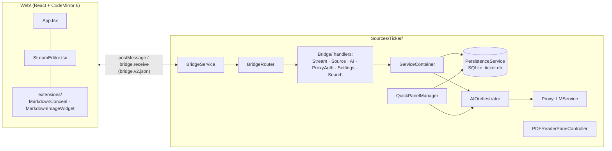
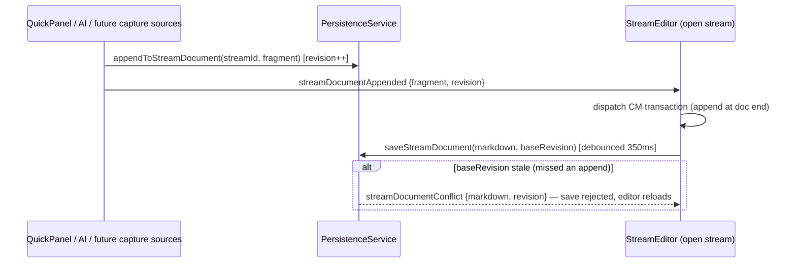

# Ticker-Next — Agent Guide

macOS app: Swift/AppKit host + React/CodeMirror 6 editor in a WKWebView, SQLite (GRDB) persistence, LLM access via a device-key proxy. This file is the single source of agent instructions (`AGENTS.md` is a symlink to it).

## Working style

- **Use the ponytail skill** (invoke via the Skill tool at task start) if you have it; if not, follow its ladder anyway: does this need to exist → stdlib → platform feature → existing dependency → one line → minimal code. Shortest working diff wins. Mark deliberate shortcuts with a `// ponytail:` comment naming the ceiling and upgrade path.
- Work in small verifiable slices; one logical change per commit; branches prefixed `codex/`; user-facing changes get one `CHANGELOG.md` line.
- Only modify files under this repo. `/Users/niko/Developer/Ticker/Ticker` (the pre-fork app) is a read-only UX reference.
- Call out bridge/persistence blast radius before touching those layers. When editor semantics or shell flow are ambiguous, ask.

## Canonical docs (in priority order)

1. `docs/PRODUCTION_READINESS_PLAN.md` — audit findings, executed stabilization phases, **feature roadmap** ("North Star: Document Reading" + Feature Surfaces). New feature work should build on the primitives named there.
2. `docs/TICKER_NEXT_MVP_PLAN.md` + `docs/EDITOR_TECH_DECISION.md` — product constraints (see Invariants below).
3. `docs/contracts/bridge.v2.json` — the live, bidirectional bridge contract. v1 is historical.

## Architecture



The one data-flow rule that keeps this app correct — **all external writes append; the editor saves with a revision check**:



## Key files

| Path | Role |
|---|---|
| `Sources/Ticker/App/WebViewManager.swift` | WKWebView ownership, drop coordination, router wiring (~725 lines; keep feature handling in `App/Bridge/`) |
| `Sources/Ticker/App/Bridge/` | `BridgeRouter`, one `*MessageHandler` per feature, `StreamCodec` (bridge encoding) |
| `Sources/Ticker/App/ServiceContainer.swift` | Composition root; the only place services are constructed |
| `Sources/Ticker/Services/PersistenceService.swift` | GRDB migrations (v1–v23, frozen), `appendToStreamDocument`, revision-checked saves |
| `Sources/Ticker/App/QuickPanel/` | ⌘L capture panel (manager/view/window) |
| `Sources/Ticker/App/PDFReader/PDFReaderPaneController.swift` | In-window PDF pane, highlight → stream linking |
| `Web/src/components/StreamEditor.tsx` | The editor: CM setup, autosave/revision, document AI, selection menu |
| `Web/src/extensions/` | CM extensions: `MarkdownConceal.ts` (static concealment), `MarkdownImageWidget.ts` |
| `Web/src/types/bridge.ts` | Message allow-list + send/sendAsync |
| `Web/src/styles/index.css` | Design tokens on `:root` (colors/type/spacing/radius/shadow, light+dark) — use tokens, never raw values |
| `tools/contracts/check_bridge_contract.mjs` | Statically validates BOTH bridge directions against `bridge.v2.json` — CI-enforced |
| `Tests/TickerTests/StreamDocumentTests.swift` · `Web/src/**/*.test.ts` | The regression net for everything above |

## Invariants (violating these reintroduces fixed bugs)

1. **One data model.** Stream content is `stream_documents.markdown` (+ `revision`). The `cells` table is frozen migration history — never write to it, never render from it.
2. **One write primitive.** Anything outside the open editor writes via `appendToStreamDocument` and announces with `streamDocumentAppended`. Never UPSERT a whole document from outside the editor; never bypass the revision check.
3. **A feature = CM extension (web) + BridgeMessageHandler (Swift) + contract entry.** Register the handler in WebViewManager's router setup, add the message to `bridge.v2.json` and `bridge.ts` — the contract checker fails CI otherwise. This is the plugin pattern; don't invent another.
4. **Product guardrails:** no cell model, no native editor, no persistent split panes (PDF pane is the sanctioned on-demand exception), autosave always on, AI apply = one undo step, **static concealment** — conceal decorations depend only on document + viewport + explicit reveal (⌥-click line, footer "Show formatting" toggle), never on selection or mouse; selection-keyed reveal reintroduces a geometry feedback loop. Markdown is an invisible substrate (storage/AI/export) — users format via the selection menu, never by knowing syntax.
5. **Migrations are append-only.** New schema = new `vN` migration; never edit v1–v23. Backup-before-migrate must keep working.
6. Editor perf: CM plugins must only walk `view.visibleRanges`; never scan the whole doc per update.

## Build / test / verify

```
./tickerctl.sh build-dev            # xcodebuild Debug (THE build gate — no standalone Swift package manifest)
./tickerctl.sh swift-test           # xcodebuild test; result in .xcresult (exit code is authoritative)
./tickerctl.sh run-dev              # Debug + Vite dev server; run-prod = Release + bundled web
cd Web && npm run typecheck && npm test && npm run build
node tools/contracts/check_bridge_contract.mjs
```

- Sparkle "no XCFramework" build error → `./tickerctl.sh clean-derived-data -y`, rebuild.
- Sandboxed environments (Codex): prefix builds with a writable `HOME`, e.g. `HOME="$PWD/.build/home" ./tickerctl.sh build-dev`.
- **End-to-end GUI verification recipe** (launch, drive quick panel/editor with osascript + CGEvent, DB assertions, cleanup): `.claude/skills/verify/SKILL.md`. Nontrivial user-facing changes should be driven there, not just typechecked.
- CI (`.github/workflows/ci.yml`) runs build+tests+contracts on every PR.
- Editor-slice manual baseline: open stream → edit → copy/paste → AI Send / Send & Prompt + one-step undo → save/reload → image insert/reload → quick panel ↵/⌘↵/⌥↵/Esc → PDF open/highlight/link round-trip when touched.

## Data safety

- Real user data: `~/Library/Application Support/Ticker-Next/` (`ticker.db`, `assets/`, `backups/`, `device.json`). Launching any locally-built app runs migrations against it — **copy `ticker.db` aside before driving the app**, and clean up any test fragments you append.
- Never log or exfiltrate the device key (`device.json`). "Fresh install" QA = delete `device.json` with the app quit.
- Two app instances sharing the DB corrupt observations — `pgrep -x TickerNext` and kill strays before launching.

## Terminology

“Window”/“page” are interchangeable for sections inside the main window (stream-list page, settings page, editor page). In the editor page: the header is chrome; everything below is the editor surface. Preserve: stream list as default page, header conventions (title/back/delete), global hotkeys (⌘L quick panel).

## Codex environment notes

- If `git fetch`/`push` are policy-blocked: `git ls-remote <remote>` to inspect, `git send-pack <remote-url> <src>:<dst>` to publish. Push only to `origin`; `upstream` is read-only.
- Multi-round work must resume the same session id (`codex exec -s workspace-write resume <id> "..."`); `-s` comes before `resume`.
