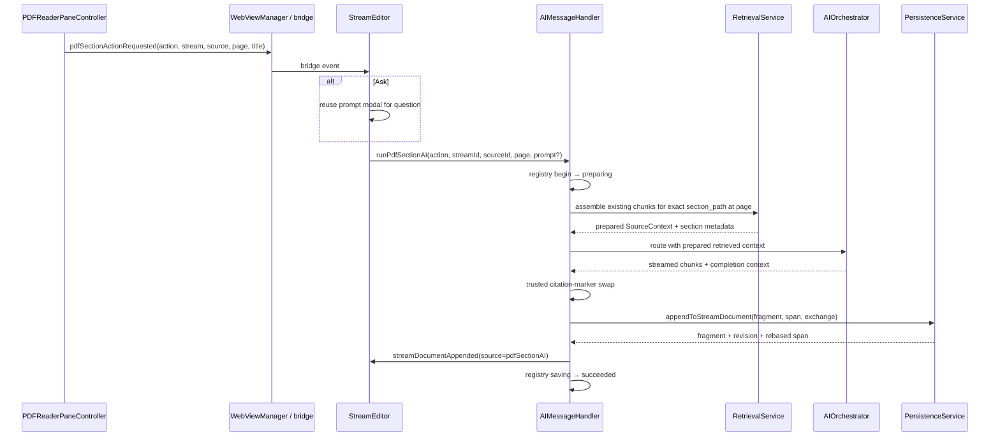

# Reading Session v1 — implementation plan

Status: reviewed with Claude; conditional-go amendments incorporated

Branch boundary: `codex/reading-session-v1` starts at stabilization commit `a58833e`

UI experiment boundary: create `codex/reading-ui-rethink` only after the functional branch is green

Claude review session: `7b3e4e66-6f18-4b0b-9338-11f46fc70621` — verdict: go after the section-budget, single-resolver, and click-versus-drag amendments now reflected below

## Outcome

Make the existing PDF/stream relationship feel complete before adding another reading model:

1. mature the quote-and-anchor behavior that is already present;
2. add outline-aware **Ask this section** and **Summarize this section** actions;
3. make saved PDF highlights navigate back to their stream locations;
4. then let Claude drive a separate, reversible UI/UX rethink over the proven behavior.

The implementation must preserve the repo's core rule: the open editor owns whole-document saves; work originating outside it writes only through `appendToStreamDocument` and announces `streamDocumentAppended`.

## What already exists

The first recommended feature was not absent. Both creation directions already work:

| User intent | Current path | Stored identity | Current return path | Gap |
|---|---|---|---|---|
| PDF selection → stream quote | Select PDF text → header link button → `pdfHighlightLinked` → insert blockquote and Markdown link at the editor cursor | `pdf_highlights.id`; URL contains `sourceId`, `highlight`, and `page` | Clicking the Markdown link opens and pulses the saved PDF highlight | The action is described as generic linking, success/failure is weakly communicated, and a failed DB save can leave a visual-only highlight until reload |
| Stream text → PDF point | Select stream text → More → Link to PDF → click a PDF point → wrap selected text in a `ticker-pdf://` Markdown link | `pdf_highlights.id`; a point annotation and Markdown URL share the ID | Clicking the linked stream text opens and pulses the point marker | “Link to PDF” does not explain that the next step is placing an anchor; a failed DB save can leave a visual-only point until reload |
| AI answer → exact PDF passage | Retrieval manifest → model marker → trusted citation swap → Markdown link with `sourceId`, `page`, `chunk`, optional exact quote | Source chunk ID; no persistent annotation required | Clicking the citation finds, centers, and flashes the verified quote, with page fallback | This is mature enough for reuse; do not build a parallel citation system |
| Saved PDF highlight → stream location | Highlight annotation contains `ticker-pdf-highlight:<highlightId>` | Existing highlight ID | None | Clicking a saved highlight does not reveal the corresponding Markdown link |
| Current PDF section → AI | PDF outline is displayed; ingestion already assigns `source_chunks.section_path`; AI operations and append receipts exist | Existing source/chunk IDs | None | No section action or section-scoped context assembly |

## Scope and explicit non-goals

In scope:

- clearer quote/anchor wording and honest success/failure feedback;
- persistence before drawing so a failed save never creates a visual-only annotation;
- current-section resolution from the existing indexed outline-aware chunks;
- background Ask/Summarize operations with visible registry state, cancellation, citations, provenance, atomic append, and normal editor arrival handling;
- direct saved-highlight → Markdown-link navigation;
- a later Claude-led consolidation of the crowded controls and overlays.

Not in this milestone:

- a new annotation or note table;
- storing editor offsets in PDF highlight rows;
- a summary tree or cached recursive summaries;
- multi-pass summarization for book-sized sections;
- OCR;
- cross-stream links/backlinks;
- manual CodeMirror chunking or another editor framework;
- another AI activity component;
- a persistent split pane beyond the existing sanctioned PDF pane;
- deleting orphaned highlights when Markdown links are undone. Undo deliberately preserves highlights so redo remains valid.

## Invariants

1. **No schema change.** Existing `pdf_highlights`, `source_chunks`, `stream_documents`, `ai_exchanges`, and provenance spans are sufficient.
2. **One anchor identity.** The PDF annotation tag and Markdown URL continue to share `pdf_highlights.id`.
3. **One citation representation.** Section AI emits opaque markers and uses `CitationMarkerSwap`; the model never creates `ticker-pdf://` URLs.
4. **One external write.** Section AI appends response + provenance + exchange atomically with `appendToStreamDocument`, then sends the standard `streamDocumentAppended` event.
5. **No speculative service layer.** Extend `RetrievalService`, `AIMessageHandler`, `PDFReaderPaneController`, and the existing bridge contract. Do not add a reading-session framework.
6. **No editor rebuild for navigation.** Reverse navigation is a one-shot full-document Markdown-link scan, not a continuously maintained index. It must not depend on CodeMirror's lazily parsed syntax tree.
7. **AI privacy remains a boundary.** A source marked excluded from AI must reject a section AI request with an honest failure state.
8. **Indexing remains non-blocking.** The PDF stays readable. A section request made before chunks are ready fails plainly and can be retried; it never sends guessed or unrelated context.
9. **Long sections fail honestly.** v1 uses one prepared section context. Expose the existing `LLMRequest` 100,000-token truncation budget as a shared constant and cap section reference material below it using the same `LLMRequest.estimateTokens` heuristic, reserving 12,000 tokens for the system prompt, wrappers, user query, and response. Over-ceiling input fails before `AIOrchestrator.route` is called. Multi-pass summaries belong to the later summary-tree work.
10. **Editor correctness stays unchanged.** Section outputs arrive through the existing revision-gap and conflict protections; in-editor document AI keeps its current one-undo behavior.

## Functional architecture

This adds two contract messages:

- Swift → Web: `pdfSectionActionRequested`
  - required: `action`, `streamId`, `sourceId`, `shortTitle`, `sectionTitle`, `page`
- Web → Swift: `runPdfSectionAI`
  - required: `action`, `streamId`, `sourceId`, `page`
  - optional: `prompt`

And one reverse-navigation event:

- Swift → Web: `revealPdfHighlightInStream`
  - required: `streamId`, `sourceId`, `highlightId`

No callback-style message is needed: section work reports progress through `aiOperationChanged`, failures through the terminal operation message, and success through `streamDocumentAppended`.

## Marker 1 — quote/link maturity

### Behavior

- Rename the PDF-side action from the ambiguous “Link selection to stream” to “Add selected quote to stream.”
- Rename the editor action from “Link to PDF” to “Anchor in PDF.”
- Keep the next-step hint already shown in the PDF header: “Click a spot to link · Esc to cancel,” adjusting “link” to “anchor” for consistent language.
- Format a PDF quote with the existing ordinary Markdown representation:
  - blockquote text;
  - one source/page Markdown link;
  - no new widget or block type.
- Preserve the current whitespace compaction for PDF line-wrap noise, but test it as a named formatter rather than leaving it inline in the React effect.
- Change both persistence callbacks to return success synchronously. The controller draws a new quote highlight or point anchor only after `savePDFHighlight` succeeds; there is no optimistic visual state to roll back.
- On successful PDF → stream insertion, clear the PDF text selection so repeat clicks do not duplicate by accident. Keep the existing web toast as the single success message; native header status remains reserved for mode instructions and errors.
- On save failure, draw nothing and send no insertion event. Retain the existing user-visible error; editor → PDF failure also sends the existing cancellation event so the pending editor selection is released.

### Likely files

- `Sources/Ticker/App/PDFReader/PDFReaderPaneController.swift`
- `Sources/Ticker/App/WebViewManager.swift`
- `Web/src/components/StreamEditor.tsx`
- `Web/src/utils/pdfAnchorSelection.ts`
- `Web/src/utils/pdfAnchorSelection.test.ts`
- `CHANGELOG.md`

### Checks

- Unit: quote formatter compacts wrapped PDF text and produces one valid blockquote/link block.
- Unit: existing pending-selection mapping and link edit tests remain green.
- Manual: select PDF text → add quote → one highlight, one stream block, one undoable editor insertion, reload preserves both.
- Manual failure probe if practical: force/induce save failure → no annotation and no stream insertion.
- Manual: select stream text → Anchor in PDF → status explains click/Esc → placed anchor wraps the original selection → click follows back.

### Commit

`fix(pdf): mature quote and anchor feedback`

Then ask Claude to review only this marker's diff for correctness, UI language, and unnecessary complexity. Resolve findings before Marker 2.

## Marker 2 — section-aware Ask/Summarize

### Section identification

The indexed chunks are authoritative for both the user-visible section name and AI context. The displayed PDF outline remains navigation UI only:

1. Determine the current one-based PDF page.
2. Find the indexed chunk for this source whose page range contains the page and whose `section_path` is non-empty.
3. Use that chunk's exact `section_path` as the section identity.
4. Load all chunks for that source with the same path, in `seq` order.
5. Convert them to the existing `RetrievedChunk` manifest representation.
6. Return page bounds, full section path, display title, and a `.retrieved` `SourceContext`.

`RetrievalService` exposes one shared section resolver used by both the PDF action menu and the AI assembler. That prevents boundary-page disagreement when several outline entries start on the same page: the exact persisted `section_path` names both the action and the text AI receives.

### Honest failures

The section assembler returns typed failures for:

- missing/wrong-stream/non-PDF source;
- source excluded from AI;
- pending/indexing source with no ready chunks;
- scanned/no-text or failed index;
- PDF without a resolvable outline section at the current page;
- section beyond the safe single-request token ceiling.

The operation registry transitions to `failed` with concise user text. It never falls back to whole-stream retrieval because that would make “this section” untrue.

### Native section actions

- Add one standard AppKit section-actions menu in the PDF header rather than two permanent buttons.
- At menu-open time, ask the existing `RetrievalService` section resolver for the active source/page descriptor through a provider callback, following the controller's existing `highlightsProvider` ownership pattern. Do not add a second PDFKit outline-range walk.
- The menu uses the chunk-resolved section title. If indexing is incomplete or the page has no indexed section, show the resolver's honest message rather than a guessed title.
- Menu items:
  - `Ask about “<section>”…`
  - `Summarize “<section>”`
- Keep the header control present but disabled when the PDF has no outline at all; controls must not jump in and out as pages change.
- The native controller emits metadata only; it does not own generation or persistence.

### Ask flow

- `pdfSectionActionRequested(action=ask)` opens the existing React modal.
- Add a `pdfSection` prompt intent rather than another modal component.
- Copy says the named PDF section will be used as context.
- Source-scope cycling is hidden for this intent because the exact source/section is already explicit.
- Submit sends `runPdfSectionAI(action=ask, prompt=...)`.
- Cancel sends nothing.

### Summarize flow

- `pdfSectionActionRequested(action=summarize)` immediately sends `runPdfSectionAI`.
- The activity capsule and end-of-document pending indicator appear through the existing operation registry path.
- The PDF remains fully usable while generation runs.

### Generation and append

- Change `AIOrchestrator.route`'s existing explicit `sourceContext` parameter from `String?` to `SourceContext?`. Quick Panel wraps its two explicit strings as `.passthrough`; document AI continues to pass no explicit context. An explicit context skips stream retrieval. Do not add a second overlapping context parameter.
- Keep the existing injected `AIMessageHandler` routing seam by passing the typed context through the existing route closure, not by creating another AI handler or service.
- Section summary prompt: faithful, concise summary of the supplied section; output body only.
- Section ask prompt: existing ask behavior, constrained by the prepared section context.
- Model markers are converted using `DocumentAICitationManifest` + `CitationMarkerSwap`.
- Append ordinary Markdown:
  - summary: linked section heading + response;
  - ask: linked `Asked of <section>` heading + quoted user question + response.
- The heading's page link is page-only and uses the existing `ticker-pdf://<source>?page=<start>` parser.
- Persist one provenance span covering the appended fragment and one `AIExchange` in the same DB transaction as the append.
- Send the normal `streamDocumentAppended` payload with `source: "pdfSectionAI"`.
- Generalize the editor's “pending external AI append” filter from only `quickPanel` to `quickPanel` and `pdfSection`; do not create a second indicator.
- Keep the summarize bridge round-trip intentionally: Ask and Summarize enter the same contracted handler, lifecycle, cancellation, and append path. A working editor web process is already required for the main application, and this avoids placing orchestration logic in `WebViewManager`.

### Cancellation and lifecycle

- Registry origin: `pdfSection`.
- Verb: `ask` or `summarize`.
- Required progression: queued → preparing → generating (on first chunk) → saving → succeeded.
- Empty output, source/context failure, provider failure, or append failure ends in failed with a concise message.
- `cancelAIOperation` cancels the attached task; callbacks check `isActive` before appending so a late completion cannot save a canceled response.
- App termination keeps the existing registry cancellation behavior.

### Likely files

- `Sources/Ticker/App/PDFReader/PDFReaderPaneController.swift`
- `Sources/Ticker/App/WebViewManager.swift`
- `Sources/Ticker/App/Bridge/AIMessageHandler.swift`
- `Sources/Ticker/Services/AIOrchestrator.swift`
- `Sources/Ticker/Services/RetrievalService.swift`
- `Sources/Ticker/Services/Prompts.swift`
- `Web/src/components/StreamEditor.tsx`
- `Web/src/types/bridge.ts`
- `docs/contracts/bridge.v2.json`
- focused Swift/Web tests
- `CHANGELOG.md`

### Bridge/persistence blast radius

- Contract: two new messages; no changed payload requirements on existing messages.
- Persistence: no migration and no new SQL. Only existing reads plus `appendToStreamDocument(..., spans:, exchange:)`.
- AI: the existing explicit context becomes typed; Quick Panel wraps passthrough text and ordinary document AI retains its old no-explicit-context behavior.
- Editor: one new prompt intent and existing append-operation origin filtering; no CodeMirror state model changes.

### Checks

- Unit: current-section resolution chooses the exact `section_path`, ordered chunks, page bounds, and refuses excluded/missing/unindexed/oversized sections.
- Unit: generated section Markdown is valid, page-linked, and uses trusted citation swaps.
- Unit: AI handler appends response + span + exchange atomically and never appends after cancellation.
- Unit: context at or below the 88,000-token reference ceiling is accepted; over-ceiling context produces the typed failure and the injected route closure is never called.
- Unit: current document AI tests prove an absent explicit context preserves retrieval behavior; Quick Panel tests prove wrapped passthrough behavior is unchanged.
- Contract checker passes.
- Manual: Ask opens the existing modal with the right section name; cancel is inert.
- Manual: Ask and Summarize show one visible operation, support Stop, append once, flash the arrival, persist after reload, and open all generated citations correctly.
- Manual: trigger while indexing/no outline/AI-excluded → honest terminal text; no unrelated answer appended.

### Commit

`feat(pdf): add section-aware AI actions`

Then resume the same Claude review session for the marker diff, focusing on context truthfulness, cancellation races, append/revision correctness, and control crowding. Resolve findings before Marker 3.

## Marker 3 — saved highlight back to stream

### Behavior

- Use the stable annotation tag already stored in `PDFAnnotation.contents`.
- On mouse-up with no intervening drag beyond a small click-slop threshold, hit-test the PDF page with `PDFPage.annotation(at:)`. Skip this behavior while anchor-pick mode is active. For a Ticker-created saved highlight or point anchor:
  - extract its highlight ID;
  - emit `revealPdfHighlightInStream`;
  - preserve normal PDFKit click/selection behavior.
- Ignore temporary citation flashes and unrelated PDF annotations because they do not carry the Ticker highlight prefix.
- In the open stream editor, scan the entire Markdown string for link URL candidates, feed each candidate through the existing `parseTickerPDFURL`, and find the link with that highlight ID. Do not rely on `syntaxTree(state)`, which may be incomplete outside CodeMirror's parsed viewport.
- If found:
  - scroll it to the center of the editor;
  - move the caret to the linked label without focusing away from the PDF;
  - show a short success toast.
- If no link exists (for example, it was undone or deleted), leave both documents untouched and show: “This highlight is no longer linked in the stream.”
- Do not persist editor offsets. The Markdown URL is the source of truth and remains correct as text moves.

### Likely files

- `Sources/Ticker/App/PDFReader/PDFReaderPaneController.swift`
- `Sources/Ticker/App/WebViewManager.swift`
- `Web/src/extensions/PDFHighlightLink.ts`
- `Web/src/extensions/PDFHighlightLink.test.ts`
- `Web/src/components/StreamEditor.tsx`
- `Web/src/types/bridge.ts`
- `docs/contracts/bridge.v2.json`
- `CHANGELOG.md`

### Checks

- Unit: link lookup finds current and legacy highlight URL forms and ignores citation/page-only links.
- Unit: Ticker annotation-tag parsing rejects unrelated annotations.
- Manual: PDF quote highlight click scrolls to its stream quote; editor-created point anchor click scrolls to its linked text.
- Manual: starting a drag selection on highlighted PDF text still selects text and does not navigate to the stream.
- Manual: undo/delete the Markdown link, click the retained highlight, receive the honest missing-link toast; redo restores navigation.
- Manual: citation flash click remains inert.

### Commit

`feat(pdf): reveal linked highlights in stream`

Then resume Claude for the final functional-diff review. Resolve findings before broad verification.

## Functional verification gate

Before any UI experiment:

1. `cd Web && npm run typecheck && npm test && npm run build`
2. `node tools/contracts/check_bridge_contract.mjs`
3. `HOME="$PWD/.build/home" ./tickerctl.sh swift-test`
4. `HOME="$PWD/.build/home" ./tickerctl.sh build-dev`
5. `git diff --check`
6. Back up `~/Library/Application Support/Ticker-Next/ticker.db`.
7. Confirm there is only one Ticker process.
8. Run the full editor/PDF manual baseline plus the marker-specific cases above.
9. Confirm DB integrity, expected stream revisions/exchanges/spans, and no disposable test content.
10. Restore the real DB and stop local Ticker/Vite processes.

Only after this gate passes is the functional head considered stable. Record its commit SHA in this document and create the child UI branch from it.

## Claude-led UI/UX rethink — separate rollback boundary

### Boundary

- Keep `codex/reading-session-v1` at the verified functional head.
- Create `codex/reading-ui-rethink` from that exact commit.
- Put every visual/interaction-only commit on the child branch.
- Do not rewrite or squash the functional commits into the UI work.
- Rolling back the experiment is therefore a branch switch, not a selective code archaeology exercise.

### Inputs for Claude

Capture a focused light/dark baseline at usable and narrow widths for the surfaces the rethink will actually change, selected from:

- stream list;
- editor header and source entry points;
- editor with PDF pane open;
- PDF text selected;
- section action menu;
- selection menu and its AI/More submenus;
- Ask modal;
- sources modal;
- active AI operation capsule;
- a document containing quote anchors, citations, images, headings, lists, and provenance.

Ask Claude, without subagents, to produce a concrete design direction covering:

- information hierarchy between global navigation, document controls, reading controls, and transient actions;
- whether PDF/source controls belong in the editor header, PDF header, or contextual menus;
- reducing nested popovers and icon ambiguity;
- making AI activity calm, trustworthy, and attributable to the initiating action;
- narrow-window behavior;
- keyboard access and VoiceOver labels;
- a token-based visual treatment that works in both themes;
- the smallest change set that materially improves comprehension.

Claude should name what to remove or consolidate before proposing new UI. Codex will challenge the design for editor geometry, bridge ownership, accessibility, and state duplication, then implement the agreed minimal experiment.

### UI implementation constraints

- No behavior or persistence changes on this branch unless a UI defect proves one necessary.
- Reuse `Modal`, existing CSS tokens, `NativePalette`, and AppKit controls.
- No new UI dependency.
- No duplicate AI state; all process UI reads the existing registry.
- No selection-dependent Markdown concealment.
- No persistent panel that reduces the editor beyond the existing PDF pane.
- Each coherent experiment is a separate commit so individual ideas can be reverted.

### UI verification

- Repeat the screenshot matrix and compare with baseline.
- Keyboard-only: editor selection menu, PDF section menu, prompt, Stop, close, and back navigation.
- VoiceOver/accessibility labels for every icon-only/native action.
- Narrow main window and full-screen PDF pane behavior.
- Entire functional gate remains green.
- Resume the same Claude session for a final visual and architectural review.

## Stop conditions

Pause implementation and revise this plan if any of the following becomes true:

- section identity cannot be derived consistently from persisted chunks and the current page;
- exact section context requires a schema migration;
- section output cannot use the existing atomic append/receipt path;
- reverse navigation requires storing editor offsets;
- changing the explicit context type changes ordinary document-AI retrieval behavior;
- PDFKit annotation clicking interferes with text selection or normal PDF navigation;
- the UI rethink would require changing editor concealment semantics.

## Definition of done

- Existing quote/anchor flows are named clearly, persist before drawing, and survive reload.
- Ask/Summarize always use the exact current indexed section or fail honestly.
- Every completed section operation has visible lifecycle, cancellation, citations, provenance, exchange receipt, one atomic append, and one arrival event.
- Clicking a persistent Ticker PDF highlight reveals its current Markdown location without stored offsets.
- All automated and GUI gates pass against a backed-up/restored user database.
- The functional branch remains independently shippable.
- The UI experiment is isolated on its child branch and has Claude's final direct review.
